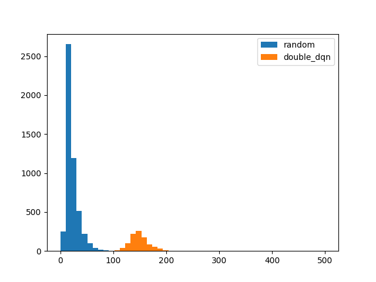
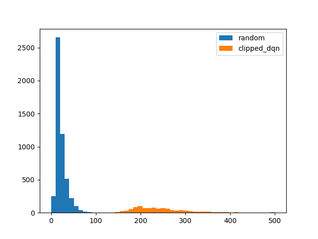
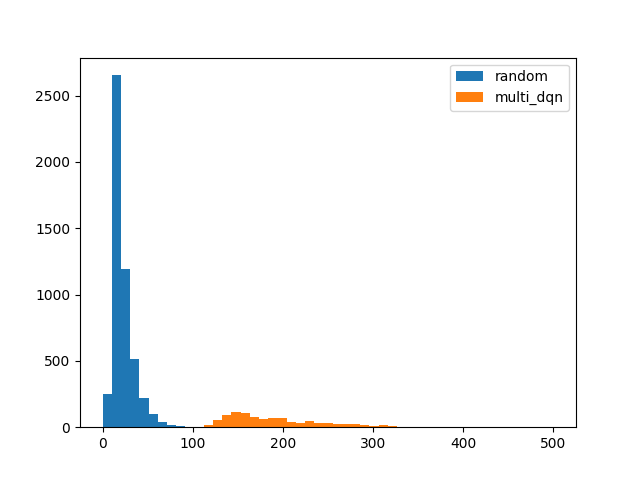

# Offline deep reinfocement learning

This repository contains implementations of various offline value-based deep reinforcement learning algorithms. The algorithms are implemented in PyTorch and are based on the following papers:

- [Double Q-learning](https://arxiv.org/pdf/1509.06461.pdf)
- [Clipped Double Q-learning](https://arxiv.org/pdf/1802.09477.pdf)
- [Multi Q-learning](https://www.researchgate.net/publication/310429350_Exploring_Deep_Reinforcement_Learning_with_Multi_Q-Learning)
- [Quantile Regression Q-learning](https://arxiv.org/pdf/1710.10044.pdf)

## Installation

Create an environment with Python 3.10, install poetry and subsequently the package using the code below from the root directory of the repository:

```bash
pip install poetry
poetry install
```

## Results

All methods apply different techniques to combat the overestimation bias of Q-learning. The algorithms are tested on a simple environment `CartPole-v1` from Gymnasium. The results are shown below:

### Random agent

Average reward: 22.0

### Double Q-learning

Average reward: 151.8



### Clipped Double Q-learning

Average reward: 246.1



### Multi Q-learning

Average reward: 195.7



### Quantile Regression Q-learning

Average reward: 266.3


